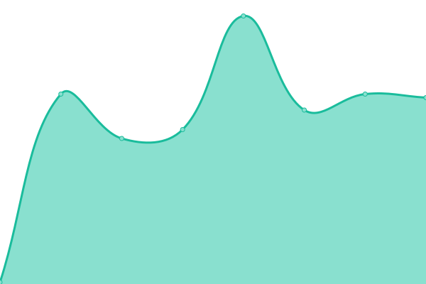

# [📈 Live Status](https://Coordinate-Cat.github.io/upptime): <!--live status--> **🟧 Partial outage**

This repository contains the open-source uptime monitor and status page for [Ocat](https://Coordinate-Cat.github.io/upptime), powered by [Upptime](https://github.com/upptime/upptime).

With [Upptime](https://upptime.js.org), you can get your own unlimited and free uptime monitor and status page, powered entirely by a GitHub repository. We use [Issues](https://github.com/Coordinate-Cat/upptime/issues) as incident reports, [Actions](https://github.com/Coordinate-Cat/upptime/actions) as uptime monitors, and [Pages](https://Coordinate-Cat.github.io/upptime) for the status page.

<!--start: status pages-->
<!-- This summary is generated by Upptime (https://github.com/upptime/upptime) -->
<!-- Do not edit this manually, your changes will be overwritten -->
<!-- prettier-ignore -->
| URL | Status | History | Response Time | Uptime |
| --- | ------ | ------- | ------------- | ------ |
|  [Github](https://github.com) | 🟩 Up | [github.yml](https://github.com/Coordinate-Cat/upptime/commits/HEAD/history/github.yml) | 

 88ms
     
 | 

<a href="https://Coordinate-Cat.github.io/upptime/history/github">100.00%</a>
    

|  [Google](https://www.google.com) | 🟩 Up | [google.yml](https://github.com/Coordinate-Cat/upptime/commits/HEAD/history/google.yml) | 

 75ms
     
 | 

<a href="https://Coordinate-Cat.github.io/upptime/history/google">100.00%</a>
    

|  [Twitter](https://twitter.com) | 🟥 Down | [twitter.yml](https://github.com/Coordinate-Cat/upptime/commits/HEAD/history/twitter.yml) | 

 104ms
     
 | 

<a href="https://Coordinate-Cat.github.io/upptime/history/twitter">14.52%</a>
    

|  [YouTube](https://www.youtube.com) | 🟩 Up | [you-tube.yml](https://github.com/Coordinate-Cat/upptime/commits/HEAD/history/you-tube.yml) | 

 403ms
     
 | 

<a href="https://Coordinate-Cat.github.io/upptime/history/you-tube">100.00%</a>
    

|  [Reddit](https://www.reddit.com) | 🟥 Down | [reddit.yml](https://github.com/Coordinate-Cat/upptime/commits/HEAD/history/reddit.yml) | 

 45ms
     
 | 

<a href="https://Coordinate-Cat.github.io/upptime/history/reddit">0.00%</a>
    

|  [Instagram](https://www.instagram.com) | 🟩 Up | [instagram.yml](https://github.com/Coordinate-Cat/upptime/commits/HEAD/history/instagram.yml) | 

 468ms
     
 | 

<a href="https://Coordinate-Cat.github.io/upptime/history/instagram">100.00%</a>
    

|  [Facebook](https://www.facebook.com) | 🟩 Up | [facebook.yml](https://github.com/Coordinate-Cat/upptime/commits/HEAD/history/facebook.yml) | 

 360ms
     
 | 

<a href="https://Coordinate-Cat.github.io/upptime/history/facebook">100.00%</a>
    

|  [Pinterest](https://www.pinterest.com) | 🟩 Up | [pinterest.yml](https://github.com/Coordinate-Cat/upptime/commits/HEAD/history/pinterest.yml) | 

 245ms
     
 | 

<a href="https://Coordinate-Cat.github.io/upptime/history/pinterest">100.00%</a>
    

<!--end: status pages-->

[**Visit our status website →**](https://Coordinate-Cat.github.io/upptime)

## 📄 License

- Powered by: [Upptime](https://github.com/upptime/upptime)
- Code: [MIT](./LICENSE) © [Ocat](https://Coordinate-Cat.github.io/upptime)
- Data in the `./history` directory: [Open Database License](https://opendatacommons.org/licenses/odbl/1-0/)
